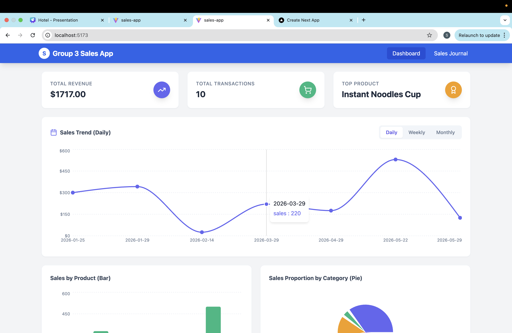
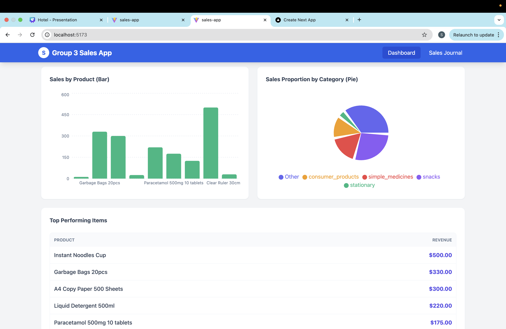

# Group 3 - Sales Dashboard Application

## Team Members

- **Soe Min Htet** (6726127)
- **Sai Khum Naung Hein** (6722075)
- **Lwin Moh Moh Theint** (6722112)

## Links

- **Live Demo:** [https://judethesleeper.github.io/sales-app/]
- **Source Code:** [https://github.com/judethesleeper/sales-app]

## Project Overview

A React-based web application to track sales and visualize business performance without a backend.

### Key Features

- **Dashboard Analytics:**
  - **Line Chart:** Visualizes daily, weekly, and monthly sales trends.
  - **Bar Chart:** Compares sales volume across different products.
  - **Pie Chart:** Shows sales proportion by category (e.g., Stationary vs. Snacks).
- **Sales Journal:** Records transactions with support for "Custom Items" and automatic totals.
- **Data Persistence:** Uses Local Storage so data is saved even after refreshing.

## Screenshots

### Dashboard (Sales Trends)

### Dashboard (Product & Category Analysis)

### Sales Journal (Transaction History)

## Tech Stack

- React JS (Vite)
- Tailwind CSS
- Recharts (Visualization)
- Lucide React (Icons)
